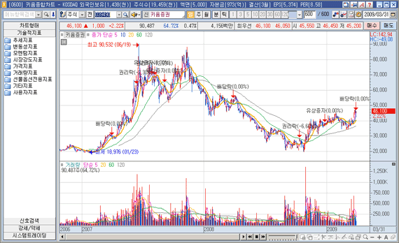
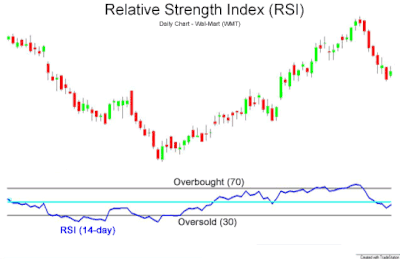
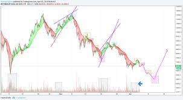

# 프로젝트 Worker의 실행파일 목록

#### 본 문서는 차트 데이터의 분석 처리 파일을 담아놓은 문서로, 머신러닝, 파라미터 튜닝등을 활용한 분석 결과 값을 내보내는 내용을 담고 있다. 

## Technical Indicator (기술적 지표)

#### 기술적 지표란, 어떤 차트의 값의 변화를 추론하여 매도와 매수를 판단하는 분석도구로, 우리가 제공하는 솔루션에는 이러한 기술적 지표의 상세값을 조정하거나 매도 수준을 조정하는데에 있다. 이는 간단하게 주기, 매도/매수 수치가 이에 포함된다.

## Fractal

#### 프렉탈이란, 주식의 패턴을 분석하여 다음 패턴을 예측하는 방식의 투자기법으로, 우린 가상 트레이더가 여러 매개변수를 읽어들여 회귀분석을 하여 가장 최적화된 트레이딩 차트를 그려내게 할 것이다.

## Fractal With Neural Prophet (!Python Script가 기본이지만 여유가 될시 c++로 작성 예정)  
#### (!Python Script가 기본이지만 여유가 될시 c++로 작성 예정) 

#### neural prophet은 주기성을 가진 데이터에 대해 강력한 추론 능력을 가진다. 우린 이 주기성 데이터를 상대할 수  있다는 점에 주목하여 Neural Prophet을 활용한 머신러닝 주가 예측을 제공한다. 배열의 형태로 제공되지만 근시안적인 주가의 흐름을 예측한다는 면에서 강력한 장점을 가지고 있다.

## MachineLearning Analysis

#### SVM, KNN, LightGBM, XGBoost등으로 대표되는 머신러닝 알고리즘은 주식데이터에 대한 머신러닝적인 분석을 제공한다. 이는 일반적인 Indicator보다 Multi Parameter를 가지기에 보다 깊은 차원의 데이터 분석을 제공하며 매수와 매도 타이밍을 신뢰도값으로 추론해낸다. 이는 N%만큼의 투자 비율 조정이 가능하며, 불신뢰도 대비 신뢰도, 신뢰도, 추천값으로 표현된다. 또한, 불신뢰도와 신뢰도에 의한 투자비율 밸런싱이 가능하다는 큰 이점을 지니고 있다.

## OrderBookAnalysis (알고리즘 연구 필요)

#### 호가창 데이터를 읽고 원하는 머신러닝 분석 결과를 내보내는 호가창 분석은 근시안적인 투자에 큰 이점을 가지고 있다. 이는 호가창이 반응하는 현재에 시세에 예민한 분석을 내보내기에 데이트레이딩(단타)에 매우 큰 이점을 가지고 있다.

## Reinforcement Learning (서버 성능이 나아지면 고려)

#### 강화학습으로 대표되는 AI 트레이더가 직접 사고파는 형식의 트레이딩 방식이다. 지금은 서버 성능 때문에 구현에 차질이 생길 것으로 보인다.

## Ensemble (복합적인 고려)

#### 각각의 머신러닝/ 기술적인 알고리즘은 해당 차트의 특이 데이터에 강력한 장점들을 가지고 거래를 한다. 이들을 연합하여 투자에 활용하면 훨씬 더 높은 성능의 투자분석을 가질 수 있다.

## MultiFactor Analysis 다 변수 분석

#### 사용자는 임의로 자신이 학습/ 분석에 쓸 데이터를 추가할 수 있다. 이는 KOSPI 종합지수, 물가상승 지수등 다양한 지표가 그 근거가 될 것이며, 현물시장과 연계한 추론으로 더한 머신러닝 분석에 자세한 분석 근거를 제공한다.
